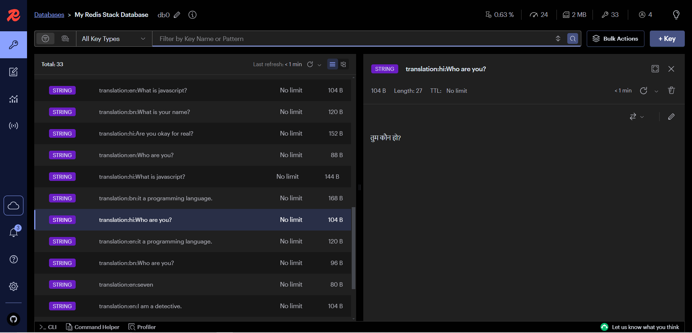
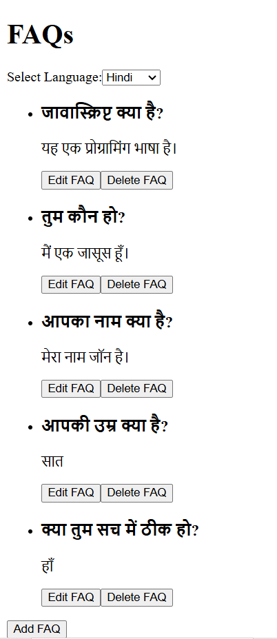
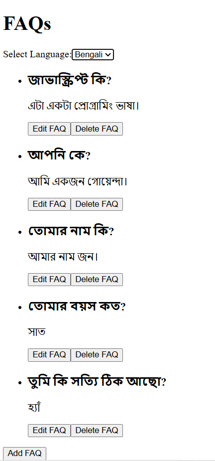
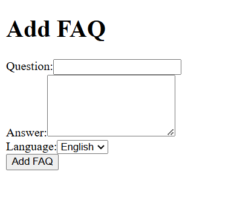
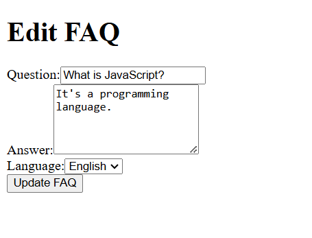

## Overview
This project is an FAQ (Frequently Asked Questions) system designed to help users find answers to common questions. The system includes a user-friendly interface and several endpoints to manage and retrieve FAQs in multiple languages using Google Gemini API.

## Features
- User-friendly UI for browsing FAQs
- API endpoints for managing FAQs

## Caching
To improve performance, the FAQ system includes caching mechanisms to store frequently accessed data. This reduces the load on the server and speeds up response times.


### Cache Configuration
- **Cache Type:** In-memory cache
- **Cache Invalidation:** Automatically invalidates when data is updated

## Multi-language Support
The FAQ system supports multiple languages, including Hindi and Bengali, to cater to a diverse user base.

### Supported Languages
- English
- Hindi
- Bengali

### Language Selection
Users can select their preferred language from the UI. The system will then display the FAQs in the selected language.

## Endpoints

### Get All FAQs
- **URL:** `/api/faqs`
- **Method:** GET
- **Description:** Retrieve a list of all FAQs.

### Get FAQ by ID
- **URL:** `/api/faqs/{id}`
- **Method:** GET
- **Description:** Retrieve a specific FAQ by its ID.

### Create FAQ
- **URL:** `/api/faqs`
- **Method:** POST
- **Description:** Create a new FAQ.
- **Body Parameters:**
    - `question` (string): The question text.
    - `answer` (string): The answer text.

### Update FAQ
- **URL:** `/api/faqs/{id}`
- **Method:** PUT
- **Description:** Update an existing FAQ.
- **Body Parameters:**
    - `question` (string): The updated question text.
    - `answer` (string): The updated answer text.

### Delete FAQ
- **URL:** `/api/faqs/{id}`
- **Method:** DELETE
- **Description:** Delete an FAQ by its ID.

## UI Structure
The UI consists of the following main components:
- **FAQ List:** Displays a list of all FAQs.





- **FAQ Form:** A form for creating or editing FAQs.





## Installation
1. Clone the repository:
     ```bash
     git clone https://github.com/yourusername/faq-system.git
     ```
2. Navigate to the project directory:
     ```bash
     cd faq-system
     ```
3. Install dependencies:
     ```bash
     npm install
     ```
4. Start the development server:
     ```bash
     npm start
     ```
